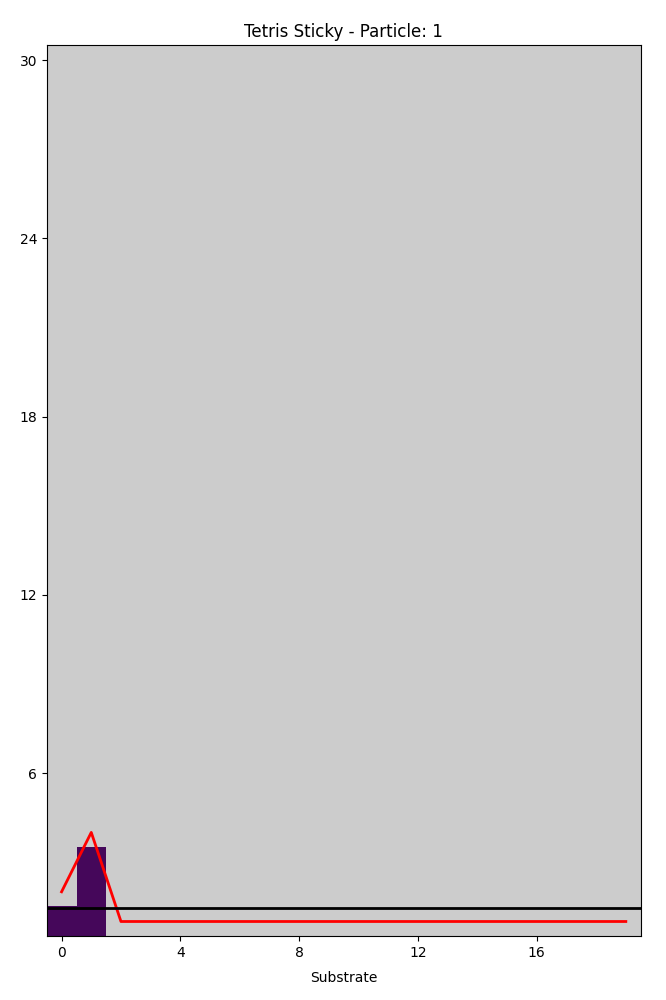

[](https://github.com/chenle02/Simulations_on_Some_Surface_Growth_Models/actions/workflows/workflow.yml)

# Simulations on Some Surface Growth Models



This repository contains simulations for various surface growth models,
developed initially as a final exam project for Math-7820 (Applied Stochastic
Processes I), Fall 2023 at Auburn University. It was further expanded as a
course project for Math-7830 (Applied Stochastic Processes II), Spring 2024.
More information about the courses can be found here: [Math-7820 Fall
2023](http://webhome.auburn.edu/~lzc0090/teaching/2023_Fall_Math7820/).

These simulations provide insights into the dynamics and characteristics of
surface growth processes, inspired by theoretical models and real-world
applications.

## Features

- Comprehensive simulations of different surface growth models.
- Easy-to-use interface for conducting and analyzing simulations.
- Detailed documentation for understanding and extending the simulations.

## Install

To get started with these simulations, you can install the package using pip:

```bash
pip install tetris-ballistic
```

Pypi link: [here](https://pypi.org/project/tetris-ballistic/).

## Sample Usage

To understand how to utilize this package, refer to the [tests](./tests) folder, which contains examples of potential usage within Python code.

Here are some simulations [examples](examples.md)

## Documentation

For detailed information about the package and its functionalities, visit our [Read the Docs](https://simulations-on-some-surface-growth-models.readthedocs.io/main/) page.

## How to Contribute

Contributions to this project are welcome! To contribute, please:

1. Fork the repository.
2. Create a new branch for your feature.
3. Add your changes and commit them.
4. Push to the branch.
5. Create a new pull request.

## References

1. Le Chen's Graduate Student Seminar talk on surface growth models: [here](https://github.com/chenle02/Graduate_Student_Seminars_by_Le_Chen/blob/main/2023-11-01/readme.md).
2. Barabási and Stanley, ''Fractal Concepts in Surface Growth'', Cambridge University Press, 1995.

## License

This project is licensed under the MIT License - see the [LICENSE](LICENSE) file for details.

## Contact

For any queries or further discussion, feel free to contact us at [email@example.com].
