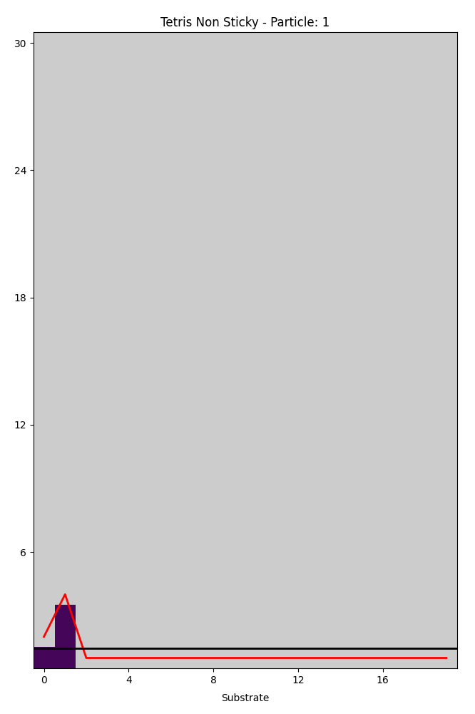

# Sticky Tetris
```bash
steps: 600
width: 20
height: 30
seed: 42
Piece-0: [0, 1]
Piece-1: [0, 1]
Piece-2: [0, 1]
Piece-3: [0, 1]
Piece-4: [0, 1]
Piece-5: [0, 1]
Piece-6: [0, 1]
Piece-7: [0, 1]
Piece-8: [0, 1]
Piece-9: [0, 1]
Piece-10: [0, 1]
Piece-11: [0, 1]
Piece-12: [0, 1]
Piece-13: [0, 1]
Piece-14: [0, 1]
Piece-15: [0, 1]
Piece-16: [0, 1]
Piece-17: [0, 1]
Piece-18: [0, 1]
Piece-19: [0, 0]
```


# Non sticky Tetris
```bash
steps: 600
width: 20
height: 30
seed: 42
Piece-0: [1, 0]
Piece-1: [1, 0]
Piece-2: [1, 0]
Piece-3: [1, 0]
Piece-4: [1, 0]
Piece-5: [1, 0]
Piece-6: [1, 0]
Piece-7: [1, 0]
Piece-8: [1, 0]
Piece-9: [1, 0]
Piece-10: [1, 0]
Piece-11: [1, 0]
Piece-12: [1, 0]
Piece-13: [1, 0]
Piece-14: [1, 0]
Piece-15: [1, 0]
Piece-16: [1, 0]
Piece-17: [1, 0]
Piece-18: [1, 0]
Piece-19: [0, 0]
```



# Mix of sticky and non sticky pieces
```bash
steps: 600
width: 20
height: 30
seed: 42
Piece-0: [1, 1]
Piece-1: [1, 1]
Piece-2: [1, 1]
Piece-3: [1, 1]
Piece-4: [1, 1]
Piece-5: [1, 1]
Piece-6: [1, 1]
Piece-7: [1, 1]
Piece-8: [1, 1]
Piece-9: [1, 1]
Piece-10: [1, 1]
Piece-11: [1, 1]
Piece-12: [1, 1]
Piece-13: [1, 1]
Piece-14: [1, 1]
Piece-15: [1, 1]
Piece-16: [1, 1]
Piece-17: [1, 1]
Piece-18: [1, 1]
Piece-19: [0, 0]
```


# 1x1 Stick block
```bash
steps: 600
width: 20
height: 30
seed: 42
Piece-0: [0, 0]
Piece-1: [0, 0]
Piece-2: [0, 0]
Piece-3: [0, 0]
Piece-4: [0, 0]
Piece-5: [0, 0]
Piece-6: [0, 0]
Piece-7: [0, 0]
Piece-8: [0, 0]
Piece-9: [0, 0]
Piece-10: [0, 0]
Piece-11: [0, 0]
Piece-12: [0, 0]
Piece-13: [0, 0]
Piece-14: [0, 0]
Piece-15: [0, 0]
Piece-16: [0, 0]
Piece-17: [0, 0]
Piece-18: [0, 0]
Piece-19: [0, 1]
``` 


# 1x1 Non stick block
```bash
steps: 600
width: 20
height: 30
seed: 42
Piece-0: [0, 0]
Piece-1: [0, 0]
Piece-2: [0, 0]
Piece-3: [0, 0]
Piece-4: [0, 0]
Piece-5: [0, 0]
Piece-6: [0, 0]
Piece-7: [0, 0]
Piece-8: [0, 0]
Piece-9: [0, 0]
Piece-10: [0, 0]
Piece-11: [0, 0]
Piece-12: [0, 0]
Piece-13: [0, 0]
Piece-14: [0, 0]
Piece-15: [0, 0]
Piece-16: [0, 0]
Piece-17: [0, 0]
Piece-18: [0, 0]
Piece-19: [1, 0]
``` 


